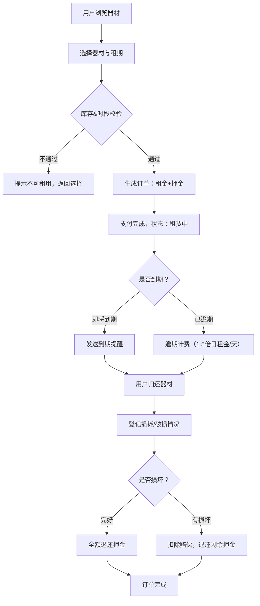

## 1. 产品概述

运动器材共享租赁平台，为用户提供各类运动装备的在线租赁服务，支持器材分类管理、库存管控、租期计算、订单全流程管理。

- 目标用户：普通运动爱好者（租用人）、门店管理员（运营方）
- 核心价值：降低运动器材使用门槛，通过共享模式提高器材利用率，提供规范化的租赁管理流程

## 2. 核心功能

### 2.1 用户角色

| 角色 | 注册方式 | 核心权限 |
|------|----------|----------|
| 普通用户 | 账号注册 | 浏览器材、下单租赁、查看订单、归还登记、个人中心 |
| 门店管理员 | 后台分配 | 器材建档、库存管理、订单审核、器材盘点、数据导出、权限管理 |

### 2.2 功能模块

1. **首页/器材列表页**：器材分类展示、搜索筛选、库存状态展示、租金信息
2. **器材详情页**：器材信息、成色描述、库存数量、单日租金、押金、可租时段选择
3. **订单确认页**：租期选择、费用自动核算、押金展示、库存校验、下单提交
4. **我的订单页**：订单列表、状态追踪、到期提醒、逾期标记、归还操作
5. **归还登记页**：归还确认、损耗/破损登记、费用结算
6. **管理员仪表盘**：数据概览、快速入口
7. **器材管理页**：器材CRUD、分类管理、成色登记、库存盘点
8. **订单管理页**：订单查询、状态流转、审核操作、数据导出
9. **登录/注册页**：用户身份认证

### 2.3 页面详情

| 页面名称 | 模块名称 | 功能描述 |
|----------|----------|----------|
| 器材列表页 | 分类筛选 | 按运动类型（球类、健身、户外、水上等）筛选器材 |
| 器材列表页 | 搜索栏 | 支持关键词搜索器材名称 |
| 器材列表页 | 器材卡片 | 展示图片、名称、成色、日租金、库存状态 |
| 器材详情页 | 器材信息 | 名称、分类、成色、库存、日租金、押金、详细描述 |
| 器材详情页 | 租期选择器 | 开始日期/结束日期选择，自动计算天数 |
| 器材详情页 | 费用预览 | 实时展示租金合计、押金、总金额 |
| 订单确认页 | 库存校验 | 下单时校验库存数量与时段冲突 |
| 订单确认页 | 费用核算 | 按租用天数自动计算租金，显示押金金额 |
| 我的订单页 | 订单列表 | 按状态（待支付/租赁中/已归还/已逾期）分组展示 |
| 我的订单页 | 到期提醒 | 即将到期订单高亮显示，剩余天数提醒 |
| 我的订单页 | 逾期计费 | 超期订单自动按日计算逾期费用（1.5倍日租金） |
| 归还登记页 | 状态登记 | 选择完好/轻微损耗/严重损坏/丢失 |
| 归还登记页 | 破损记录 | 上传备注、图片描述，生成损耗记录 |
| 归还登记页 | 费用结算 | 扣除相应赔偿费用后退还押金 |
| 器材管理页 | 器材建档 | 新增器材：名称、分类、成色、初始库存、日租金、押金 |
| 器材管理页 | 库存盘点 | 调整库存数量，记录盘点日志 |
| 订单管理页 | 订单查询 | 多条件筛选（用户、时间、状态、器材） |
| 订单管理页 | 数据导出 | 支持导出Excel/CSV格式订单报表 |

## 3. 核心流程

用户租赁流程：浏览器材 → 选择器材与租期 → 系统校验库存与时段 → 确认订单（支付租金+押金）→ 领取器材 → 使用期间（到期提醒）→ 归还登记（损耗检查）→ 费用结算 → 退还押金

管理员运营流程：器材建档入库 → 库存盘点 → 订单监控 → 到期/逾期跟进 → 归还核验 → 损耗记录 → 数据报表导出

## 4. 用户界面设计

### 4.1 设计风格

- 主色调：活力橙 #FF6B35（运动、活力）+ 深墨绿 #1A3A2A（专业、信任）
- 辅助色：金色 #D4AF37（品质感）、浅灰 #F5F5F5
- 按钮风格：圆润大按钮，主色填充带微渐变，hover有轻微上浮效果
- 字体：标题使用 "Oswald" 粗体（运动感），正文使用 "Noto Sans SC"（清晰易读）
- 布局风格：卡片式布局，带阴影层次，顶部导航 + 侧边分类筛选
- 图标风格：线性图标配合运动emoji 🏀🏋️🚴🏊

### 4.2 页面设计概览

| 页面名称 | 模块名称 | UI元素 |
|----------|----------|--------|
| 器材列表页 | Hero横幅 | 大标题、渐变背景、运动主题插画、搜索框居中 |
| 器材列表页 | 分类标签 | 横向滚动分类胶囊，选中态高亮 |
| 器材列表页 | 器材网格 | 3列卡片网格，卡片hover微放大+阴影加深 |
| 器材详情页 | 主图区 | 大图+缩略图切换，状态徽章叠加 |
| 器材详情页 | 租期面板 | 日历双选控件，天数与费用实时联动计算 |
| 订单管理页 | 数据表格 | 斑马纹表格，状态彩色标签，操作按钮组 |
| 管理员仪表盘 | 统计卡片 | 4色统计卡片带图标，数据动态显示 |

### 4.3 响应式

桌面优先设计，适配1280px以上宽度；平板端网格降为2列；移动端单列布局，底部Tab导航。

## 5. 状态流转定义

订单状态：待支付 → 租赁中 → 已归还/已逾期 → 已完成
器材状态：在库 → 已出租 → 维修中 → 已报损
