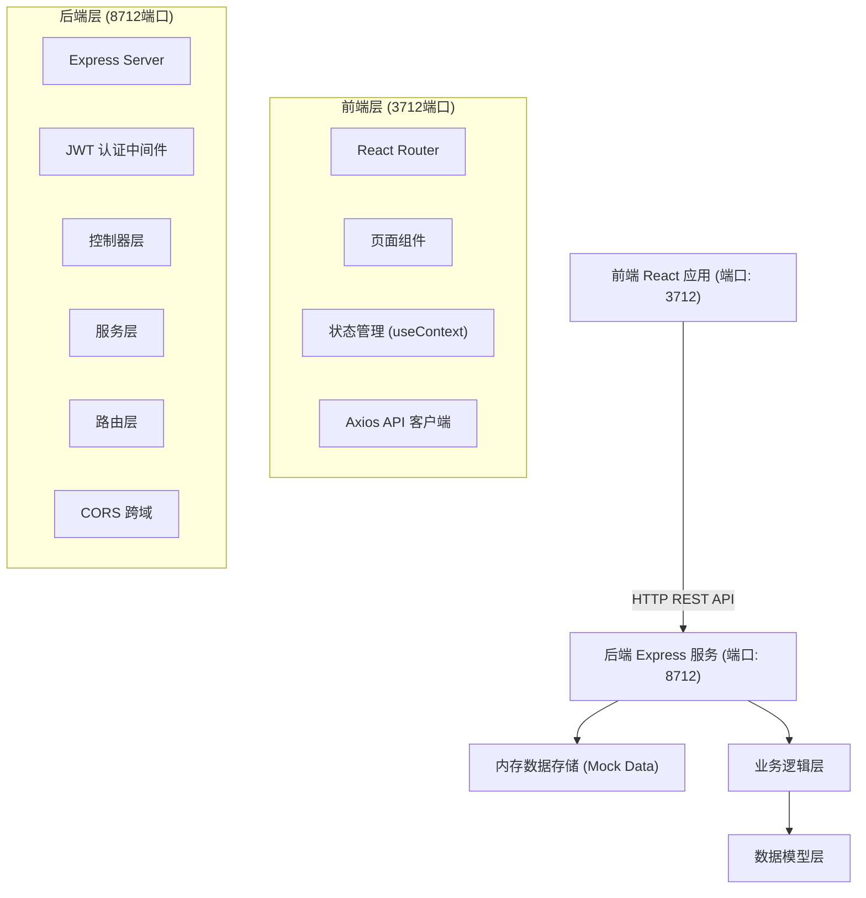
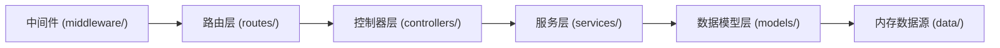
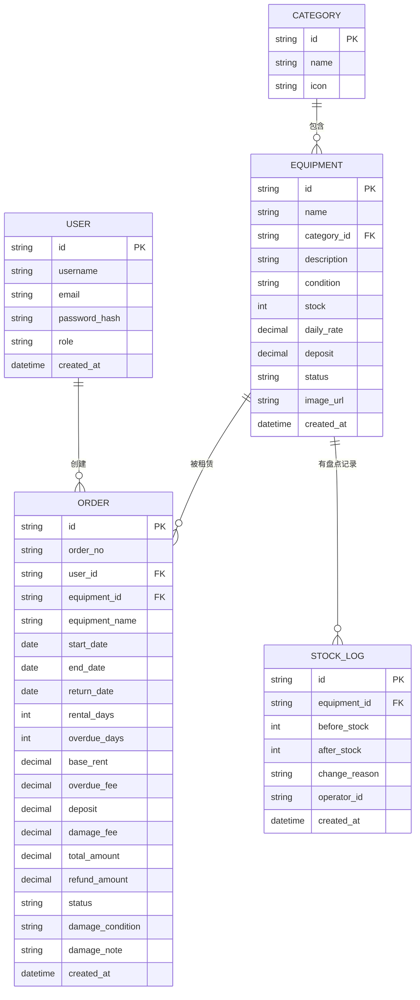

## 1. 架构设计



## 2. 技术选型

- **前端**: React 18 + TypeScript + Vite 5 + TailwindCSS 3 + React Router 6
- **前端 UI**: 自定义组件 + Lucide React 图标库 + date-fns 日期处理
- **后端**: Node.js + Express 4 + TypeScript
- **后端工具**: cors 跨域、jsonwebtoken 认证、bcryptjs 密码加密
- **数据存储**: 内存 Mock 数据（含初始化种子数据），不依赖外部数据库
- **HTTP 客户端**: Axios
- **代码规范**: ESLint + TypeScript Strict Mode

## 3. 路由定义

### 前端路由 (3712端口)

| 路由路径 | 页面名称 | 权限要求 |
|----------|----------|----------|
| `/login` | 登录页 | 公开 |
| `/register` | 注册页 | 公开 |
| `/` | 器材列表首页 | 公开 |
| `/equipment/:id` | 器材详情页 | 公开 |
| `/orders` | 我的订单 | 用户登录 |
| `/orders/:id/return` | 归还登记页 | 用户登录 |
| `/admin/dashboard` | 管理仪表盘 | 管理员 |
| `/admin/equipment` | 器材管理 | 管理员 |
| `/admin/orders` | 订单管理 | 管理员 |

### 后端 API 路由 (8712端口)

| 方法 | 路由 | 用途 | 权限 |
|------|------|------|------|
| POST | `/api/auth/register` | 用户注册 | 公开 |
| POST | `/api/auth/login` | 用户登录 | 公开 |
| GET | `/api/auth/me` | 获取当前用户 | Token |
| GET | `/api/equipment` | 获取器材列表 | 公开 |
| GET | `/api/equipment/:id` | 获取器材详情 | 公开 |
| POST | `/api/equipment` | 新增器材 | 管理员 |
| PUT | `/api/equipment/:id` | 更新器材 | 管理员 |
| DELETE | `/api/equipment/:id` | 删除器材 | 管理员 |
| POST | `/api/equipment/:id/stock` | 库存盘点调整 | 管理员 |
| GET | `/api/equipment/categories` | 获取器材分类 | 公开 |
| GET | `/api/orders` | 获取订单列表 | Token(本人)/管理员 |
| GET | `/api/orders/:id` | 获取订单详情 | Token(本人)/管理员 |
| POST | `/api/orders` | 创建订单 | Token |
| POST | `/api/orders/:id/return` | 归还登记 | Token(本人)/管理员 |
| GET | `/api/orders/export` | 导出订单数据 | 管理员 |
| GET | `/api/dashboard/stats` | 仪表盘统计 | 管理员 |

## 4. API 数据定义

### 核心类型定义

```typescript
// 用户
interface User {
  id: string;
  username: string;
  email: string;
  role: 'user' | 'admin';
  createdAt: string;
}

// 器材分类
interface Category {
  id: string;
  name: string;
  icon: string;
}

// 器材
interface Equipment {
  id: string;
  name: string;
  categoryId: string;
  description: string;
  condition: '全新' | '9成新' | '8成新' | '7成新' | '较旧';
  stock: number;
  dailyRate: number;
  deposit: number;
  status: '在库' | '已出租' | '维修中' | '已报损';
  imageUrl: string;
  createdAt: string;
}

// 订单
interface Order {
  id: string;
  orderNo: string;
  userId: string;
  equipmentId: string;
  equipmentName: string;
  startDate: string;
  endDate: string;
  returnDate?: string;
  rentalDays: number;
  overdueDays: number;
  baseRent: number;
  overdueFee: number;
  deposit: number;
  damageFee: number;
  totalAmount: number;
  refundAmount: number;
  status: 'pending' | 'renting' | 'returned' | 'overdue' | 'completed' | 'cancelled';
  damageCondition?: '完好' | '轻微损耗' | '严重损坏' | '丢失';
  damageNote?: string;
  createdAt: string;
}

// 库存盘点记录
interface StockLog {
  id: string;
  equipmentId: string;
  beforeStock: number;
  afterStock: number;
  changeReason: string;
  operatorId: string;
  createdAt: string;
}
```

### 核心请求响应

**创建订单请求**:
```typescript
POST /api/orders
Request: { equipmentId: string; startDate: string; endDate: string }
Response: Order | { error: string }
```

**归还登记请求**:
```typescript
POST /api/orders/:id/return
Request: { damageCondition: string; damageNote?: string }
Response: Order
```

## 5. 后端分层架构



目录结构：
```
backend/
├── src/
│   ├── index.ts           # 入口，启动 Express
│   ├── routes/            # 路由定义
│   ├── controllers/       # 请求处理
│   ├── services/          # 业务逻辑
│   ├── middleware/        # 认证、错误处理
│   ├── data/              # Mock 数据与种子数据
│   ├── types/             # TypeScript 类型
│   └── utils/             # 工具函数
├── package.json
└── tsconfig.json
```

## 6. 数据模型

### 6.1 ER 关系图



### 6.2 种子数据

**初始分类**: 球类运动 🏀、健身器材 🏋️、户外装备 🏕️、水上运动 🏊、冰雪运动 ⛷️、骑行装备 🚴

**初始器材**: 篮球、羽毛球拍、瑜伽垫、哑铃套装、帐篷、登山杖、皮划艇、滑雪板、公路自行车等（每种含成色、库存、日租金、押金）

**初始用户**: 
- 管理员: admin / admin123
- 普通用户: user / user123

## 7. 核心业务规则

1. **库存校验**: 创建订单时校验所选时段内该器材可用库存
2. **租期计算**: `rentalDays = ceil((endDate - startDate) / 86400000)`，最少1天
3. **基础租金**: `baseRent = rentalDays × dailyRate`
4. **逾期计算**: 超过 endDate 未归还，按日计算逾期费 `overdueFee = overdueDays × dailyRate × 1.5`
5. **损坏赔偿**: 
   - 完好：damageFee = 0
   - 轻微损耗：damageFee = deposit × 0.2
   - 严重损坏：damageFee = deposit × 0.8
   - 丢失：damageFee = deposit（全额扣除）
6. **退款金额**: `refundAmount = deposit - damageFee`
7. **订单总额**: `totalAmount = baseRent + overdueFee + deposit`
